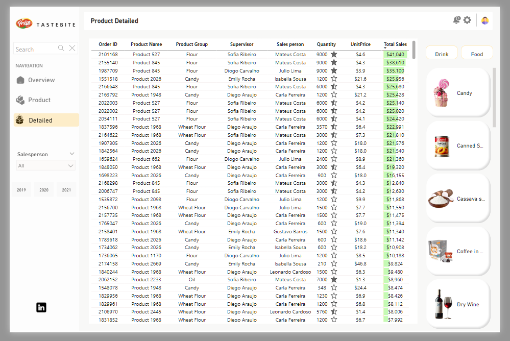

# Tastebite Food and Drinks Dashboard

[Watch Video](https://drive.google.com/file/d/1RTf09nrXjRAvjjWoMWFVIKJaB7deddO4/view?usp=drive_link)

## Introduction
This project focuses on developing an interactive Power BI dashboard to analyze and visualize sales performance for a food distribution business. The dashboard provides insights into revenue, order volume, and product sales trends. The goal is to help stakeholders make data-driven decisions regarding product performance, sales channels, and employee productivity.

## Problem Statement
The business needs a structured, data-driven approach to analyzing food product sales and understanding key performance indicators (KPIs) such as revenue trends, best-selling products, sales efficiency by employees, and sales performance by channel. 
The main problems addressed in this analysis include:
- Identifying top-performing products and salespersons.
- Understanding seasonal trends in sales.
- Evaluating sales distribution across different channels.
- Improving decision-making for sales strategies.

## About the Dataset
The dataset used in this project consists of transactional sales data for a variety of food and beverage products. It includes details such as:
- product categories
- sales transactionz
- salespersons
- supervisors
- order channels
- time-based attributes.
The dataset is structured into multiple relational tables to facilitate efficient querying and analysis.

### Key Tables in the Dataset:
- Fact_OrderTable: Contains sales transaction details including order numbers, products sold, quantities, salespersons, supervisors, and sales channels.
- Dim_Product: Holds product-related attributes such as product name, category, and group.
- Dim_SalesPerson: Includes information about sales employees.
- Dim_Date: Stores date-related fields to enable time-based analysis.
- ChannelTable: Defines various sales channels for order categorization.
- Calculation Table: Includes pre-defined calculated measures and color indicators for visualization purposes.

## Power BI Concepts Applied
- Data Transformation: Power Query was used to clean and structure the data.
- Data Modeling: Relationships between tables were established to ensure data integrity.
- DAX Calculations: Custom measures were created for aggregations like total sales, order count, and percentage growth.
- Visualization: Various Power BI visuals such as bar charts, line graphs, matrices, and KPI indicators were used to present insights.

## Data Modeling

The data model follows a star schema structure, optimizing performance and ease of analysis. The Fact_OrderTable serves as the central fact table, connected to various dimension tables such as Dim_Product, Dim_SalesPerson, and Dim_Date. Relationships are established as follows:
- One-to-Many Relationship: Between Dim_Product and Fact_OrderTable using ProductKey.
- One-to-Many Relationship: Between Dim_SalesPerson and Fact_OrderTable using SalespersonKey.
- One-to-Many Relationship: Between Dim_Date and Fact_OrderTable using OrderDate.
- Independent Lookup Tables: ChannelTable and Calculation Table for filtering and dynamic calculations.

## Visualization

[Interact with Dashboard](https://app.powerbi.com/view?r=eyJrIjoiNmRhOGYzNDUtOTBmMC00NDQ0LWI4OGItYjE2OWQwNWVmODU1IiwidCI6IjZiYjI1Yjk2LTlhZTItNDkxMy1hZTYxLThmOGE3NDNjYTY5NiJ9)

### The Power BI dashboard consists of three main sections:
- Overview Page: Displays key metrics such as total revenue, total orders, and total quantity sold, along with top-performing products, salespersons, and supervisors.
- Product View Page: Provides a categorized view of products sold, segmented into food and drinks.
- Product Detailed Page: Uses a matrix visual to display individual transaction records with details like order ID, product name, unit price, sales volume, and total sales.

## Discussion
The dashboard enables an in-depth analysis of sales trends, highlighting top revenue-generating products and high-performing employees. By analyzing seasonal sales patterns, the business can plan inventory and promotions effectively. Additionally, the dashboard helps identify underperforming products or sales channels that need strategic improvements.

## Conclusion and Recommendation
### Conclusion:
- The dashboard effectively provides an interactive view of sales performance and key business insights.
- The data model ensures efficient querying and analysis by maintaining clear relationships between tables.
- Insights from the dashboard can help in better decision-making for product promotions and sales strategies.

### Recommendations:
- Expand the dataset to include customer demographics for deeper customer segmentation analysis.
- Implement machine learning models within Power BI to predict future sales trends.
- Automate data refresh schedules to keep reports updated in real-time.
- Integrate external data sources such as market trends and competitor analysis to enhance insights.

This project successfully demonstrates the power of Power BI in transforming raw sales data into actionable insights for decision-makers.
- Created by: James Isaac
- Built with: Power BI
- Dataset: Tastebite sales dataset

